  

<h2 align="center">
  Hi 👋, I'm Md. Soliman Sikder
</h2>

<h3 align="center">
  💻 Frontend Developer
</h3>

  

  

---

## 👨‍💻 About Me

I'm a passionate **Frontend Developer** who enjoys building modern, responsive, and user-friendly web experiences.

I mainly work with **React, Next.js, JavaScript, HTML, CSS, TypeScript, and Tailwind CSS**. Currently, I'm expanding my skills toward **Full-Stack Development**.

- 💻 Frontend Developer focused on **React & Next.js**
- ⚛️ Building responsive and interactive web interfaces
- 🌱 Currently learning **Full-Stack Web Development**
- 🚀 Building real-world projects to improve my skills
- 🎨 Interested in clean UI, modern design, and better web experiences

---

# 📊 GITHUB STATISTICS & ANALYSIS

## 🟩 GitHub Contributions

  

---

# 🛠️ TECHNOLOGY STACK

## 💻 Languages

  

## 🎨 Frontend & UI

  

## ⚙️ Backend & Frameworks

  

## 🗄️ Database & Services

  

## 🔧 Tools & Version Control

  

---

# 🚀 CURRENTLY LEARNING

  

  <strong>Full-Stack Web Development</strong>

  Expanding my frontend skills into backend development,
  APIs, databases, authentication, and full-stack applications.

---

# 🌟 FEATURED PROJECTS

## 🖥️ Boss Lab — JS Console

A JavaScript-based interactive console project built to practice and demonstrate JavaScript concepts.

### 🛠️ Technology Stack

`HTML` `CSS` `JavaScript`

### 🔗 Links

🌐 **Live Demo:**  
https://boss-lab-js-console.vercel.app/

💻 **Source Code:**  
https://github.com/mdsolimansikder7/Boss-Lab--JS-Console

---

## 🧮 Web Calculator

A simple, responsive, and interactive calculator built for the web.

### 🛠️ Technology Stack

`HTML` `CSS` `JavaScript`

### 🔗 Links

🌐 **Live Demo:**  
https://mdsolimansikder7.github.io/web-calculator/

💻 **Source Code:**  
https://github.com/mdsolimansikder7/web-calculator

---

# 🌐 CONNECT WITH ME

  
  &nbsp;&nbsp;&nbsp;
  

  <a href="https://www.linkedin.com/in/md-soliman-sikder-b17887237/">
    LinkedIn
  </a>
  &nbsp;•&nbsp;
  <a href="mailto:mdsolimansikder62@gmail.com">
    Email
  </a>

---

# 💻 CODING PROFILES

---

# 📈 GITHUB STATS

  

  

---

# 🔥 GITHUB STREAK

  

---

# 🎯 MY GOAL

  <strong>
    Become a skilled Full-Stack Web Developer by continuously learning,
    building real-world projects, and improving every day.
  </strong>

---

# 📫 CONTACT

  

---

<h3 align="center">
  🚀 Learn • Build • Improve • Grow
</h3>

  Thanks for visiting my profile! ⭐

