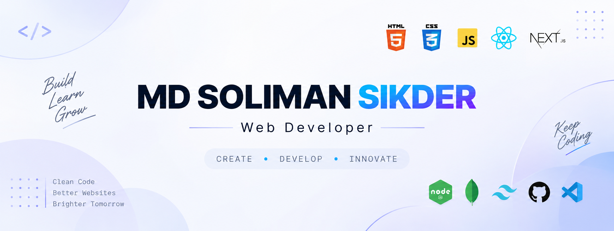

<div align="center">



# 👋 Hi, I'm Md Soliman Sikder

### 🚀 Web Developer | 💻 Frontend Developer | 🌱 Full-Stack Learner

**Always Learning, Building & Improving**

</div>

---

## 👨‍💻 About Me

I'm **Md Soliman Sikder**, a Computer Science & Engineering student and aspiring Web Developer from Bangladesh.

I enjoy creating modern, responsive, and user-friendly websites while continuously learning new technologies and improving my development skills.

- 🎓 Computer Science & Engineering Student
- 💻 Passionate about Web Development
- 🌱 Currently learning **Next.js, React & TypeScript**
- 🚀 Interested in **Frontend & Full-Stack Development**
- 🧠 Always learning new technologies
- 🔨 Building projects to improve my practical skills
- 🇧🇩 Based in Bangladesh

---

## 🛠️ Technologies & Tools

### 🌐 Frontend Development

<p align="left">

</p>

### ⚙️ Backend & Database

<p align="left">

</p>

### 💻 Programming

<p align="left">

</p>

### 🔧 Tools

<p align="left">

</p>

---

## 🚀 Featured Projects

### 🧮 Web Calculator

A responsive calculator website built with JavaScript.

🔗 **Live Demo:**  
https://mdsolimansikder7.github.io/web-calculator/

🔗 **Source Code:**  
https://github.com/mdsolimansikder7/web-calculator

---

### ⚡ Boss Lab JS Console

A JavaScript-based console project created to practice JavaScript fundamentals and programming concepts.

🔗 **Live Demo:**  
https://boss-lab-js-console.vercel.app/

🔗 **Source Code:**  
https://github.com/mdsolimansikder7/Boss-Lab--JS-Console

---


## 📊 GitHub Stats

<div align="center">


<br>


</div>

---

## 🔥 GitHub Streak

<div align="center">


</div>

---

## 🎯 My Development Journey

```text
Learn → Practice → Build → Improve → Repeat 🔄
